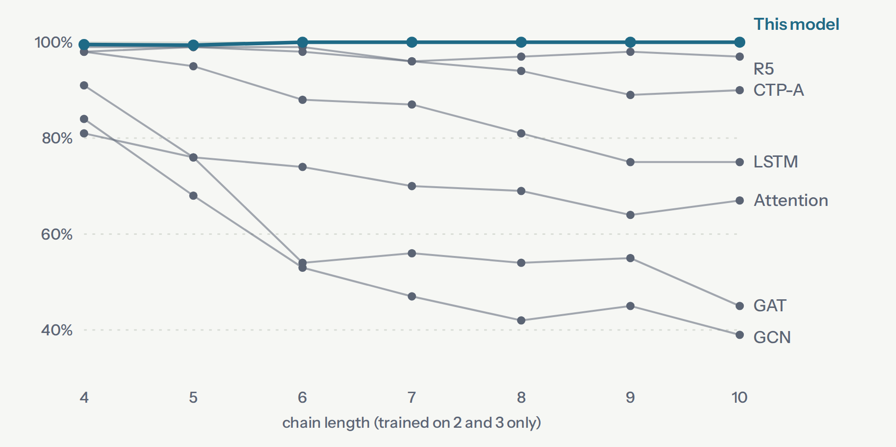

# bicyclic-kinship

[](https://doi.org/10.5281/zenodo.23071497)

A sound, set-valued model of relational composition, derived from opaque symbols.
Zero dependencies, pure Python: 3,146 lines of source, about 2,000 of them code (not counting
comments and docstrings).

Give it products `a o b = c`. It derives the laws that explain them, from a small menu of
algebraic shapes. Give it a chain of relations of any length and it names **every** relation
still consistent with those laws: a set, because sometimes the honest answer is two names.

On [CLUTRR](https://github.com/facebookresearch/clutrr), trained on short chains and tested on
longer ones:

| | |
|---|---|
| soundness, all 2929 held-out stories, five independently generated instances | **100.00%** |
| top-1 on chain lengths 4–10, never seen in training | **99.80%** |
| top-1 on chain lengths 5–10 of the sixth instance, trained on its own lengths 2–4 | **99.39%** |
| top-1 across all five instances | 97.06% (ceiling 97.13%) |
| supplied domain knowledge | **none** |
| training products the whole model is derived from | **62** |

That is the same level as the best published systems (R5, NCRL, EpiGNN), not better: they sit
within their own run-to-run spread of 100%, and they were measured on CLUTRR's original data
release, while these runs use the HuggingFace release of the same splits.



*Top-1 accuracy on chains longer than any seen in training. Trained networks decay as chains
grow; a derived law has nothing to decay. Baselines from R5 (Lu et al., 2022), Table 2.*

## Two writeups

- [*Who Is Your Daughter's Grandfather?*](https://stevesolvesproblems.github.io/bicyclic-kinship/clutrr-explained.html)
  A plain-language explainer: the model, all six CLUTRR datasets, depth to 10,000 steps,
  related work and open questions. Start here.
- [*Deriving Composition Laws, and Trying to Break Them*](https://stevesolvesproblems.github.io/bicyclic-kinship/method-and-evidence.html)
  The technical companion: the mathematics, every measurement, the stress tests, the
  corrections, and how the work was placed in the literature.

Both are in `docs/`, as HTML and as Markdown.

## Install and run

```bash
pip install -e .

# CLUTRR data lives outside this package. These are the files behind the HuggingFace
# release (CLUTRR/v1), about 57 MB for all six datasets:
for d in gen_train23_test2to10 gen_train234_test2to10 \
         rob_train_{clean,disc,irr,sup}_23_test_all_23; do
  mkdir -p data/clutrr/$d
  for f in train validation test; do
    curl -sfL -o data/clutrr/$d/$f.csv \
      https://raw.githubusercontent.com/kliang5/CLUTRR_huggingface_dataset/main/$d/$f.csv
  done
done
export CLUTRR_DIR=$PWD/data/clutrr/gen_train23_test2to10   # the others sit alongside it

python -m bicyclic_kinship.benchmark   # all six datasets and the ablation, about 5 seconds
python -m bicyclic_kinship.noise       # false and irrelevant input facts
python -m bicyclic_kinship.worlds      # family trees, in-laws, depth to 10,000, paths, a grid
python -m bicyclic_kinship.stress      # evidence, label noise, tree seeds, refusals, cost
pytest                                 # 59 tests; the CLUTRR half skips without CLUTRR_DIR
```

Every number in the writeups is printed by one of those four scripts or asserted by a test.
Nothing is averaged over runs: the derivation is deterministic, and seeded experiments fix
their seeds.

Verbatim output of `python -m bicyclic_kinship.benchmark`:

```
trained on 9074 chains of length 2-3 from gen_train23_test2to10
derived from 62 observed products over 20 symbols
  AxisSystem over 20 symbols: 1 additive, 4 cone, right-projection with 6 classes

instance                                 n    sound    top-1    set  ceiling
----------------------------------------------------------------------------
gen_train23_test2to10                 1146   1.0000   0.9939  1.119   0.9956
rob_train_clean_23_test_all_23         447   1.0000   1.0000  1.651   1.0000
rob_train_disc_23_test_all_23          445   1.0000   0.9483  1.652   0.9483
rob_train_irr_23_test_all_23           444   1.0000   0.9369  1.914   0.9369
rob_train_sup_23_test_all_23           447   1.0000   0.9374  1.783   0.9374
----------------------------------------------------------------------------
TOTAL                                 2929   1.0000   0.9706  1.503   0.9713

extrapolation on gen_train23_test2to10 (trained on k=2,3 only)
k             2       3       4       5       6       7       8       9      10
n            38     105     190     174     107     144     150     119     119
sound     1.000   1.000   1.000   1.000   1.000   1.000   1.000   1.000   1.000
top-1     1.000   0.952   0.995   0.994   1.000   1.000   1.000   1.000   1.000

k>=4 (unseen lengths): n=1003  sound=1.0000  top-1=0.9980

extrapolation on gen_train234_test2to10 (trained on its own k=2,3,4)
  AxisSystem over 20 symbols: 1 additive, 4 cone, right-projection with 6 classes
k             2       3       4       5       6       7       8       9      10
n            38     107      77     185     105     155     135     124     122
sound     1.000   1.000   1.000   1.000   1.000   1.000   1.000   1.000   1.000
top-1     1.000   0.953   0.870   0.984   1.000   0.987   1.000   1.000   1.000
k>=5 (unseen lengths), own model        : n=826  sound=1.0000  top-1=0.9939
k>=5 (unseen lengths), gen_train23 model: n=826  sound=1.0000  top-1=1.0000

ablation (all five instances, top-1)
  everything                     top-1 0.9706   sound 1.0000
  without the cone lane          top-1 0.8645   sound 1.0000
  without the projection lane    top-1 0.7050   sound 1.0000
  cone lane alone                top-1 0.7050   sound 1.0000
  without the path rules         top-1 0.9682   sound 1.0000

preference misses outside the corpus's own ambiguity: 2
```

`ceiling` is the best any function of the relation chain alone could score: the corpus
answers some chains two ways, always `mother`/`mother-in-law` or `father`/`father-in-law`.

## Using it

```python
s.solve(chain)   # what the derived laws ADMIT.   Sound. Set-valued. Never guesses.
s.best(chain)    # what the evidence FAVOURS.     A preference. Can be wrong.
s.explain(chain) # why.
```

The solver takes `(chain, answer)` pairs over any symbols. Products of length 2 are the
derivation; longer chains are used only to audit a derived law and to count preference
evidence.

```python
from bicyclic_kinship import Solver, cone_compose

# Your vocabulary and your observed products. (Generated here so the example is
# self-contained; in practice these are pairs you observed in your own data.)
NAMES = {"self": (0, 0), "parent": (1, 0), "child": (0, 1), "sibling": (1, 1),
         "grandparent": (2, 0), "grandchild": (0, 2), "pibling": (2, 1), "nibling": (1, 2)}
products = [((a, b), n) for a, ca in NAMES.items() for b, cb in NAMES.items()
            for n, c in NAMES.items() if c == cone_compose(ca, cb)]

s = Solver.train(products)                                   # 42 products
s.solve(("child", "parent", "sibling", "parent", "child"))   # ['sibling']
s.solve(("child",) * 30 + ("parent",) * 30)                  # ['self']   -- depth 60
s.solve(("child",) * 40 + ("parent",) * 39)                  # ['child']  -- depth 79
s.solve(("child",) * 500 + ("parent",) * 500)                # ['self']   -- depth 1000
```

What the derivation needs is the composition behaviour, not a name and not a meaning. Two
opt-in extensions are off by default and change no CLUTRR number: route memory
(`Solver.train(..., route="move")`) and word senses (`bicyclic_kinship.senses.SensedSolver.train`).

## Layout

```
src/bicyclic_kinship/
    derive.py       exact rational null space; additive laws; products -> triples
    cone.py         the bicyclic fold, and the search for (u, d) assignments
    projection.py   classes decided by the last step or the first, by union-find
    system.py       the derived laws, composition, and the audit
    pathrules.py    derived if-thens over the chain -- preference only
    solver.py       solve() / best() / explain() / score()
    route.py        opt-in: the smallest route automaton consistent with the data
    senses.py       opt-in: one word, several addresses
    clutrr.py       dataset loading; the symbolic form only, prose is never parsed
    benchmark.py    python -m bicyclic_kinship.benchmark
    noise.py        python -m bicyclic_kinship.noise
    worlds.py       python -m bicyclic_kinship.worlds
    stress.py       python -m bicyclic_kinship.stress
docs/
    clutrr-explained.{html,md}      the plain-language explainer
    method-and-evidence.{html,md}   the technical companion
tests/
    test_standalone.py   59 tests: synthetic algebras first, CLUTRR regression second
```

The synthetic algebras come first in the test suite on purpose: a stack algebra, an additive
ladder, left- and right-zero semigroups, a structureless magma and `Z/5`. Their only job is to
fail if domain knowledge ever leaks into the source.

## Citing

Archived on Zenodo: [doi:10.5281/zenodo.23071497](https://doi.org/10.5281/zenodo.23071497) (all versions;
v0.1.0 is [10.5281/zenodo.23071498](https://doi.org/10.5281/zenodo.23071498)). GitHub's "Cite this repository"
button reads `CITATION.cff`.

This work is not on arXiv. I'm open to submitting it: arXiv asks first-time authors for an
endorsement from an established author in the category (cs.AI or cs.LG here). If you can
endorse and think it's worth it, please open an issue.

## License

MIT.
